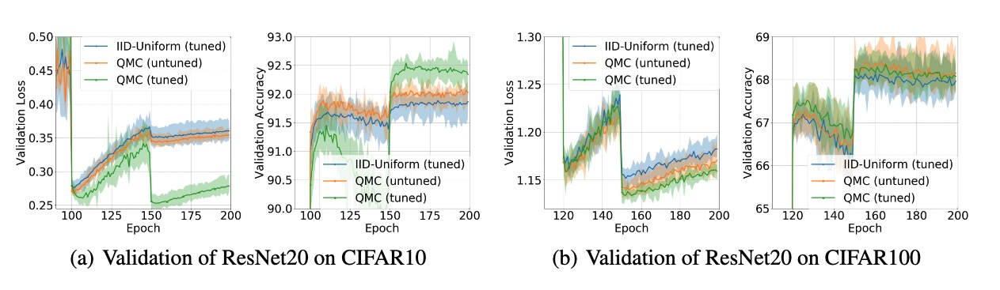

## A General Analysis of Example-Selection for Stochastic Gradient Descent
---
[Yucheng Lu](https://www.cs.cornell.edu/~yucheng/)\*, [Si Yi Meng](https://www.cs.cornell.edu/~siyimeng/)\* and [Christopher De Sa](http://www.cs.cornell.edu/~cdesa/)

In the [Tenth International Conference on Learning Representations (ICLR) 2022](https://iclr.cc/Conferences/2022).

**Note:**
This repository contains the source code for the empirical results in our [ICLR'22 paper](https://openreview.net/pdf?id=7gWSJrP3opB) on QMC-based data ordering analysis. It provides implementation on two Quasi-Monte-Carlo (QMC) related methods:
* Greedy sorting to construct better example ordering at the beginning of each epoch.
* QMC-based data augmentation.
  
## 1. Example Ordering with Greedy Sorting
### 1.1 Example-Ordered SGD via Greedily Minimizing Average Gradient Error
One of the key insights from our [paper](https://openreview.net/pdf?id=7gWSJrP3opB) is that: if the examples are ordered in a way such that the averages of consecutive example gradients converge faster to the full gradient, then running SGD with such ordering will enjoy a faster convergence rate.
Given this insight, we propose a greedy selection algorithm that can minimizes a metric named *Averaged Gradient Error* ([Equation 2](https://openreview.net/pdf?id=7gWSJrP3opB)), which allows us to use better example ordering at the beginning of each epoch. 

Detailed pseudo-code can be found in Algorithm 1 in our [paper](https://openreview.net/pdf?id=7gWSJrP3opB). Informally, we store the gradients computed for each mini-batch from the previous epoch, and then launch a sorting process over these gradients. To optimize the space/time complexity for the sorting, we additionally provide techniques of random projection and QR decomposition. An example script is provided in [commands](https://github.com/EugeneLYC/qmc-ordering/tree/main/commands) to train logistic regression with greedy sorting on MNIST. We can run it with
```
bash commands/lg_mnist.sh
```

### 1.2 Toy Example on synthetic Gaussian
We provide the source code (in [Julia](https://julialang.org/)) for reproducing the toy example of Gaussion ([Figure 1](https://openreview.net/pdf?id=7gWSJrP3opB)) in the [toy_gaussian repo](https://github.com/EugeneLYC/qmc-ordering/tree/main/toy_gaussian).


## 2. QMC-based Data Augmentation
### 2.1 Examples from the paper
The rationale for data augmentation is that by performing some reasonable random transformation on a given example, we assume the output would be another example that is identically distributed, and the expected value models an infinitely-large training set consisting of such transformed examples. Traditional methods augment data in a uniform fashion. Leveraging our insight from the greedy algorithm, we apply QMC points in data augmentation and expect the optimizer would converge faster to the population distribution (i.e., better generalization). An example script is provided in [commands](https://github.com/EugeneLYC/qmc-ordering/tree/main/commands) to train Resnet20 on CIFAR10 with QMC-based data augmentation. We can run it with
```bash
bash commands/resnet_cifar10.sh
```

### 2.2 Build Customized QMC-based Data Augmentation
We provide APIs for customized data augmentation. This code base supports all the randomized data augmentation techniques included by [torchvision.transforms](https://github.com/pytorch/vision/blob/main/torchvision/transforms/transforms.py).
Users can then specify their own transforms (with order preserved). As an example, the CIFAR10 transforms can be given by,
```json
{
    "RandomHorizontalFlip": {
        "p": 0.5
    },
    "RandomCrop": {
        "size": 32,
        "padding": 4
    },
    "ToTensor": {},
    "Normalize": {
        "mean": [0.485, 0.456, 0.406],
        "std": [0.229, 0.224, 0.225]
    }
}
```
and pass to the training script via `--transforms_json`. Then the QMC-sampling-enabled dataset can be created via `QMCDataset`. Concretely, take CIFAR10,
```python
import torch
from qmcordering.qmcda.utils import get_transforms
from qmcordering.qmcda.datasets import QMCDataset

# The args should contain --transforms_json
qmc_transforms, qmc_quotas = get_transforms(args)

cifar10 = QMCDataset(dataset=datasets.CIFAR10(...),
                    transforms=qmc_transforms,
                    qmc_quotas=qmc_quotas,
                    ...)

dataloader = torch.utils.data.DataLoader(cifar10,
                                        ...)
```
For more details, please refer to [the dataloader script](https://github.com/EugeneLYC/qmc-ordering/blob/main/qmcordering/build_dataloader.py).

### 2.3 Empirical Results

For detailed experimental settings, please refer to the [paper](https://openreview.net/pdf?id=7gWSJrP3opB).


## 3. Citation
To cite this paper/code base, please use the following bibtex:
```
@inproceedings{
  lu2022a,
  title={A General Analysis of Example-Selection for Stochastic Gradient Descent},
  author={Yucheng Lu and Si Yi Meng and Christopher De Sa},
  booktitle={International Conference on Learning Representations},
  year={2022},
  url={https://openreview.net/forum?id=7gWSJrP3opB}
}

```